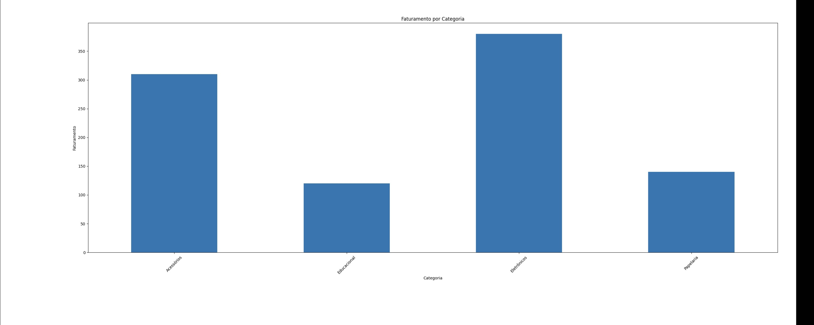

# 📊 Análise de Dados de Vendas

## 📌 Sobre o projeto
Este projeto tem como objetivo analisar dados de vendas e gerar insights estratégicos a partir das informações.
A análise foi realizada utilizando Python, com foco em manipulação de dados e visualização.

## 🛠 Tecnologias utilizadas
- Python
- Pandas
- Matplotlib
  
## 📊 Análises realizadas
- Cálculo do faturamento total
- Identificação do produto mais vendido
- Faturamento por categoria
- Análise de vendas por mês

## 📈 Resultados

## 🧠 Insights
- A categoria **Eletrônicos** apresentou o maior faturamento, indicando alta demanda por produtos tecnológicos.
- O produto mais vendido demonstra preferência por itens de uso frequente.
- Categorias com menor faturamento podem representar oportunidades de crescimento.
- A análise mensal permite identificar períodos de maior desempenho em vendas.

## 🚀 Objetivo
Este projeto foi desenvolvido com o objetivo de praticar análise de dados, utilizando Python para extrair informações relevantes e gerar valor a partir dos dados.

## ▶️ Como executar
1. Instale as bibliotecas:
   pip install pandas matplotlib

2. Execute o arquivo:
   python analise.py
